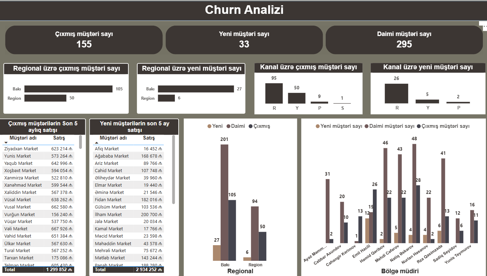

# 🧠 Müştəri İtkisi (Churn) Analizi – Power BI

Bu layihə Power BI vasitəsilə hazırlanmış **churn analizi dashboardu**dur.  
**Churn** — müştərilərin müəyyən dövr ərzində xidmətdən imtina etməsi və ya şirkəti tərk etməsi hallarını ifadə edir.  
**Churn analizi** müştəri itkisini ölçmək, səbəbləri anlamaq və gələcəkdə bu itkini azaltmaq üçün aparılır.  
Bu analiz şirkətlərə **riskli müştəriləri vaxtında müəyyənləşdirmək** və **saxlama strategiyalarını təkmilləşdirmək** imkanı yaradır.
---

## 📊 Dashboard Görüntüləri

---

DAX və Query İstifadəsi
DAX (Data Analysis Expressions): Müştəri davranışı və churn göstəricilərini hesablamaq üçün istifadə olunur (məsələn, churn rate, aktiv müştəri sayı).
Query (Power Query / Məlumat Transformasiyası): Verilənləri təmizləmək, birləşdirmək və analiz üçün hazırlamaq məqsədilə istifadə olunur.

